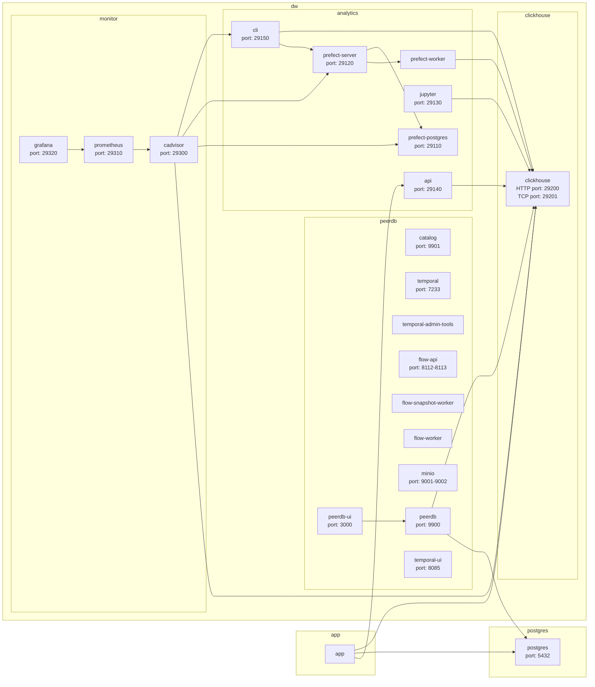

# dw

## Guides

- [Installation](docs/01-install.md)
- [ClickHouse](docs/02-clickhouse.md)
- [PeerDB](docs/03-peerdb.md)
- [Analytics: Projects](docs/04-projects.md)
- [Analytics: dbt](docs/05-dbt.md)
- [Analytics: Jupyter Notebook](docs/06-jupyter.md)
- [Analytics: API](docs/07-api.md)
- [Analytics: Prefect](docs/08-prefect.md)
- [Analytics: Operations](docs/09-operations.md)

## File system

```shell
.
├── analytics
│   ├── .dbt # dbt profiles
│   ├── .devcontainer # VS Code dev container configuration
│   ├── .prefect # Prefect profiles
│   ├── examples
│   │   └── tutorial # Tutorial project
│   ├── package # Supplementary CLI and common utilities
│   ├── projects # Data models, Python tasks, workflows, notebooks and tests
│   ├── templates
│   │   └── project # Template for new projects
│   ├── .bashrc # Shell configuration used in CLI container
│   ├── .gitconfig # Git configuration used in CLI container
│   ├── .gitignore # Git configuration used in CLI container
│   ├── .pre-commit-config.yaml # Pre-commit hooks configuration
│   ├── .sqlfluff # SQL linter configuration used in CLI container
│   ├── .sqlfluffignore # SQL linter configuration used in CLI container
│   ├── .yamllint # YAML linter configuration used in CLI container
│   ├── Dockerfile
│   ├── pyproject.toml # Configuration of Python tools in CLI container
│   ├── requirements_api.txt # Extra Python dependencies of API container
│   ├── requirements_base.txt # Python dependencies of all containers
│   ├── requirements_dev.txt # Python development dependencies
│   └── requirements_jupyter.txt # Extra Python dependencies of Jupyter container
├── clickhouse # ClickHouse configurations
├── deploy # Docker container configurations
├── docs
├── monitor # Monitoring configurations
├── peerdb
└── scripts # Installation scripts
```

## Architecture



## License

Copyright (c) 2023 Hein Bekker. Licensed under the GNU Affero General Public License, version 3.
