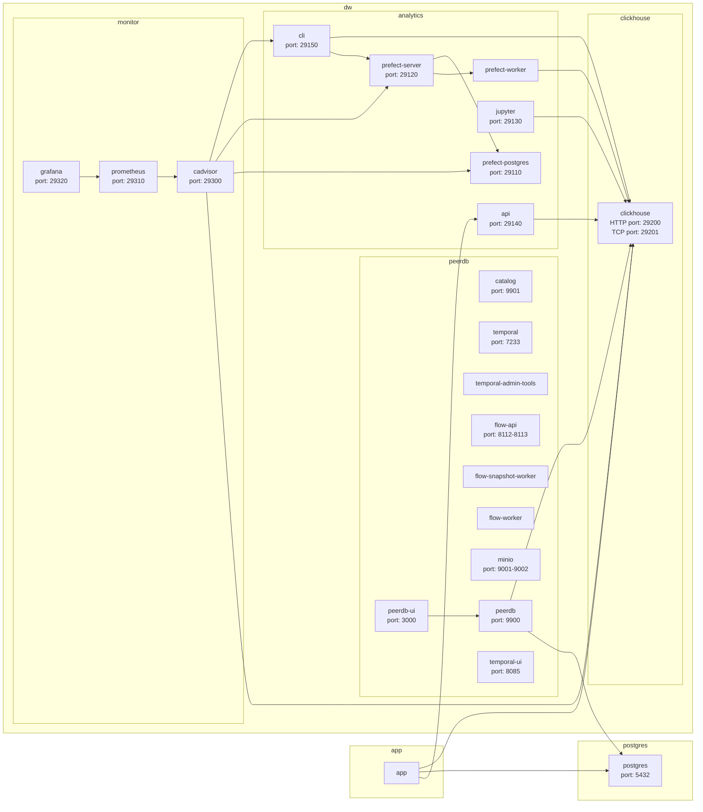

# Documentation

## Guides

- [Installation](01-install.md)
- [Projects](02-projects.md)
- [dbt](03-dbt.md)
- [Jupyter Notebook](04-jupyter.md)
- [API](05-api.md)
- [PeerDB](06-peerdb.md)
- [Prefect](07-prefect.md)
- [Operations](08-operations.md)

## Architecture overview

## Resources

- [ClickHouse docs](https://clickhouse.com/docs)
- [ClickHouse SQL reference](https://clickhouse.com/docs/en/sql-reference)
- [dbt reference](https://docs.getdbt.com/reference/references-overview)
- [Jinja syntax reference](https://jinja.palletsprojects.com/en/3.1.x/templates/)
- [Jupyter Notebook docs](https://jupyter-notebook.readthedocs.io/en/latest/)
- [PeerDB docs](https://docs.peerdb.io)
- [Postgres docs](https://www.postgresql.org/docs/current/index.html)
- [Postgres SQL reference](https://www.postgresql.org/docs/current/sql-commands.html)
- [Prefect docs](https://docs.prefect.io)
- [pytest docs](https://docs.pytest.org/en/8.3.x/)
